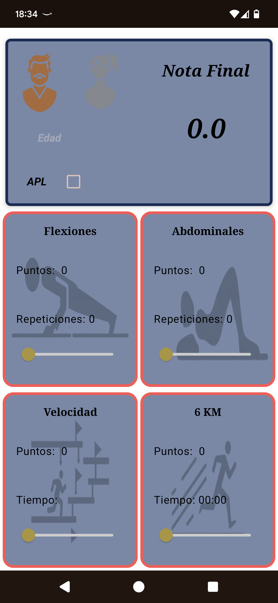
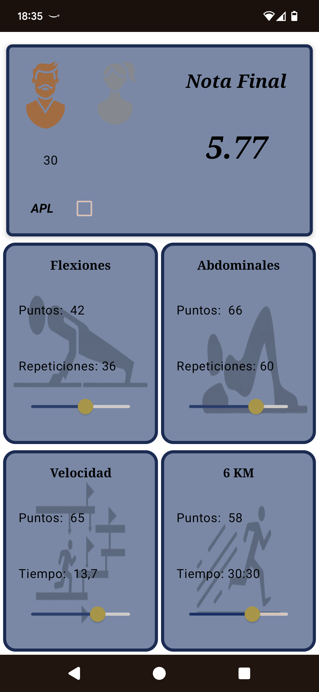

# TGCF 🏋️
Aplicación Android desarrollada en Kotlin con Jetpack Compose para calcular la puntuación final del Test General de Condición Física del Ejército, adaptándose a diferentes grupos de edad y marcas físicas obtenidas.

## Características principales
- 📅 Selección de grupo de edad por rangos (17-21, 22-26, etc.)
- 🏃 Cálculo de puntuación para diferentes pruebas físicas, así como el calculo de la nota media de todas las que realices:
  - Carrera de resistencia
  - Flexiones
  - Abdominales
  - Pista de agilidad
- 📱 Interfaz moderna y responsive con Jetpack Compose

## Tecnologías utilizadas
- **Lenguaje**: Kotlin 100% interoperable
- **UI**: Jetpack Compose + Material3
- **Arquitectura**: MVVM (Model-View-ViewModel)
- **Inyección de dependencias**: Hilt

Uso
1. Ingresa tu edad exacta
2. Selecciona tu género
3. En caso de que sea Apto con Limitiaciones marca la casilla de APL
4. Introduce tus marcas obtenidas en cada una de las pruebas
5. Visualiza tu puntuación total

## 📸 Capturas de pantalla

  
   

## Arquitectura
El proyecto sigue los principios MVVM y Clean Architecture:

Copy
📁 app/
├── 📁 data/        
├── 📁 domain/      
├── 📁 ui/ # Capa de presentación
│   ├── 📁 model 
│   ├── 📁 view     # Configuración de Material Theme
│   └── 📁 viewmodel # ViewModels inyectados con Hilt

## Próximas implementaciones
- - Room Database
  - DataStore
- **Testing**: JUnit, MockK, Espresso

## Contacto
¿Preguntas o sugerencias? ¡Contáctame en adriancarrerolucha93@gmail.com
